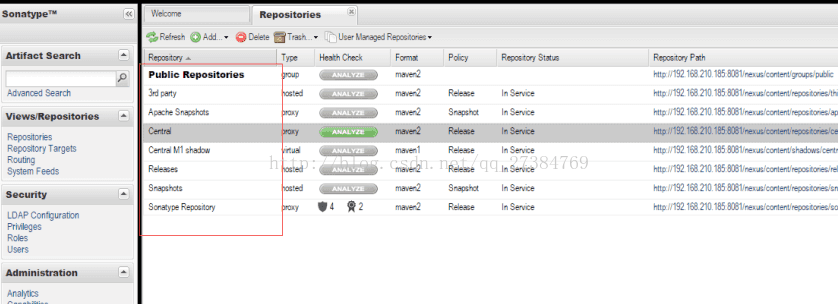
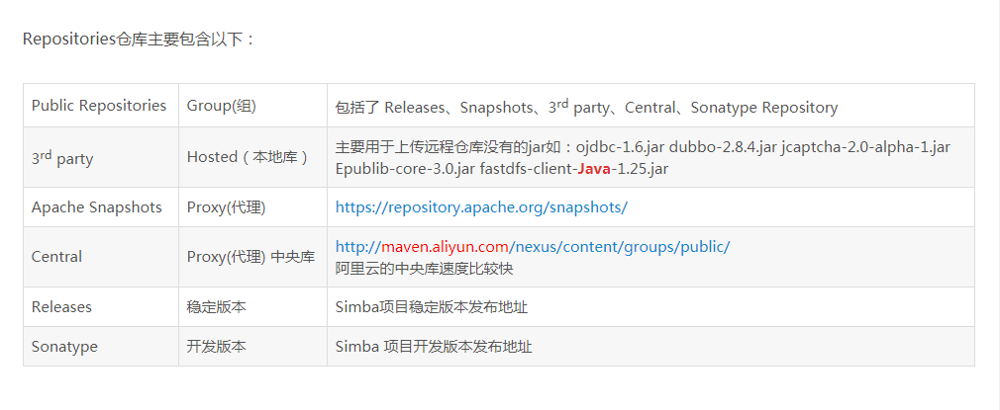

* nexus长这个样子

* Repositories仓库里的内容是干嘛的呢？

* 配置maven的 Setting.xml
* 其中有些配置一般是在项目里配置的
Setting.xml其中包含配置本地库、配置nexus私有库、deploy发布账号配置、默认开发环境JDK设置、生成环境配置信息
其中一份常用的setting.xml文件请移步 [maven_setting.xml](/maven_setting.xml)